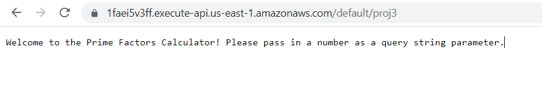
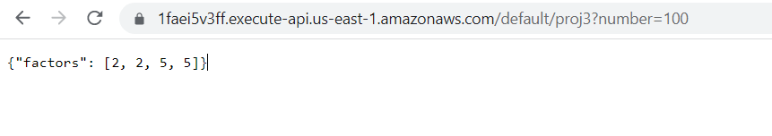

# Project 3 - Serverless Prime Factorization

My project 3 is an AWS Lambda function that calculates prime factorization. The AWS Lambda function is triggered by an AWS API Gateway. The whole application is deployed serverless. 

## Example Usage
* root directory displays welcome message

* add `?number=100` benhind the url to calculate the prime factorization of 100

## Deployment
API Endpoint: https://1faei5v3ff.execute-api.us-east-1.amazonaws.com/default/proj3

